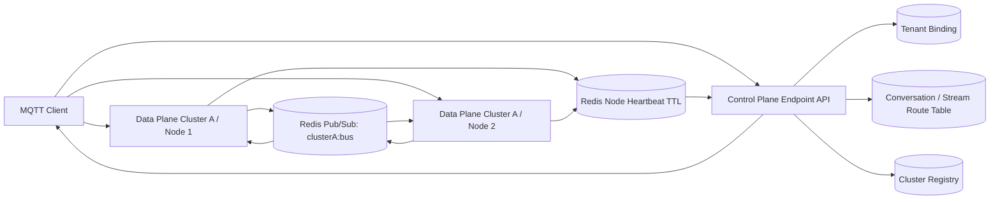
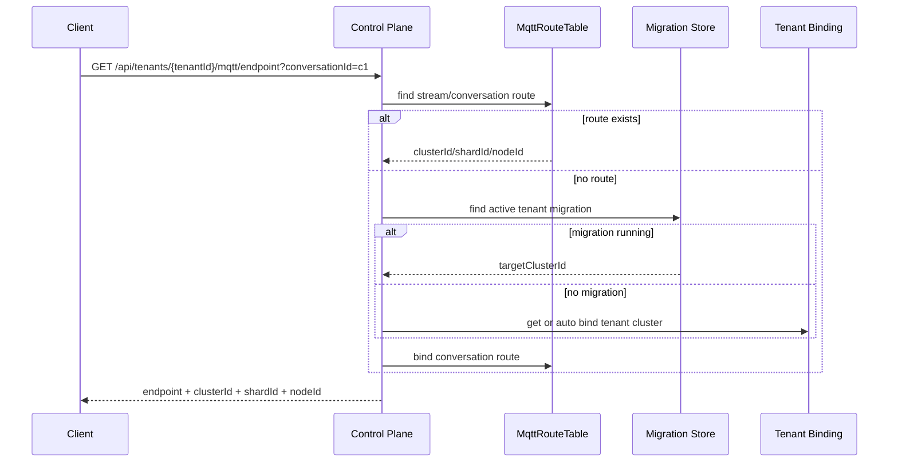
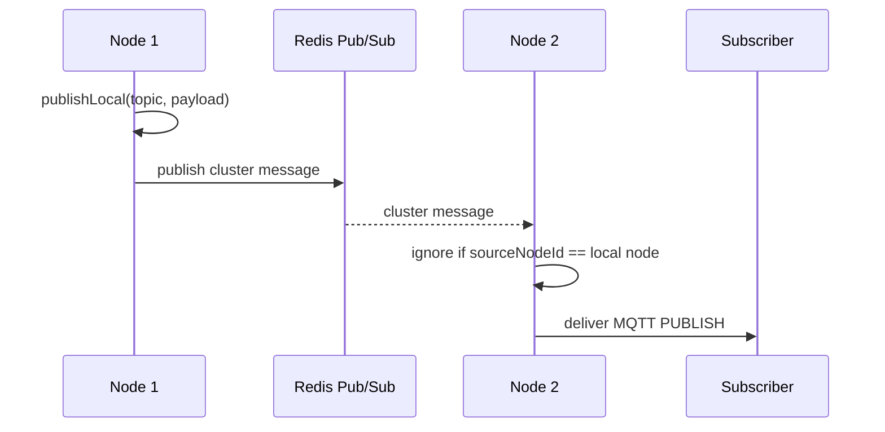
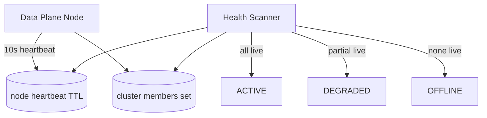
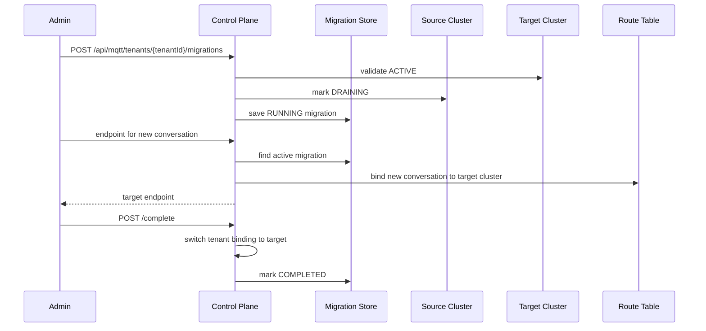

# MQTT 多 Data Plane 架构设计

本文档描述 ChatPass MQTT Control Plane + 多 Data Plane 的核心设计，覆盖 Redis Pub/Sub 集群总线、节点心跳、会话级路由表和灰度迁移流程。

## 目标

- 支持一个 Control Plane 管理多个 MQTT Data Plane 集群。
- 避免构建超大单一 MQTT 集群，将租户、会话和流固定路由到明确的集群和分片。
- 支持同一 Data Plane 集群内多节点广播，保证订阅者可以在任意节点接收消息。
- 支持灰度迁移：新会话进入目标集群，已有会话沿用原路由，降低切换风险。

## 核心组件

| 组件 | 代码 | 职责 |
| --- | --- | --- |
| MQTT Control Plane | `MqttClusterControlService` | 管理集群、租户绑定、endpoint 分配和迁移 |
| Redis 集群总线 | `RedisMqttClusterBus` | 在同一 `clusterId` 内通过 Redis Pub/Sub 广播 MQTT 消息 |
| 节点心跳 | `MqttNodeHeartbeatService` | 写入节点 TTL 心跳并刷新集群健康状态 |
| 会话路由表 | `MqttRouteTable` | 保存 `conversationId/streamId -> clusterId/shardId/nodeId` |
| 灰度迁移 | `MqttTenantMigrationService` | 保存租户迁移计划和 active migration 索引 |
| 流式发布 | `MqttStreamPublisher` | 将 LLM stream event 投递到 MQTT 集群广播链路 |

## 总体架构

## Endpoint 分配流程

客户端获取 MQTT endpoint 时，Control Plane 按以下优先级解析：

1. 如果提供 `streamId` 且存在 stream 路由，返回该路由对应的集群。
2. 如果提供 `conversationId` 且存在 conversation 路由，返回该路由对应的集群。
3. 如果租户存在运行中的迁移计划，新会话返回目标集群。
4. 否则返回租户绑定的集群；未绑定时自动绑定到可用 ACTIVE 集群。
5. 如果提供了新的 `conversationId`，Control Plane 会创建 conversation 路由。

## 集群内消息广播

客户端或服务端发布 MQTT 消息后，当前节点先本地投递，再通过 Redis Pub/Sub 广播到同一集群的其他节点。收到 Redis 消息的节点忽略 `sourceNodeId` 等于本节点的消息，避免重复投递。

## 节点心跳与健康检测

每个 Data Plane 节点定时写入 Redis TTL key，并将节点 ID 加入 cluster member set。健康扫描按 live node 数量刷新集群状态：

- `ACTIVE`：已知节点全部存活。
- `DEGRADED`：存在部分节点心跳过期。
- `OFFLINE`：没有任何存活节点。
- `DRAINING` 和 `DISABLED` 由运维流程控制，健康扫描不会覆盖。

## 灰度迁移流程

迁移适合租户从源集群平滑切到目标集群。启动迁移后，源集群可进入 `DRAINING`，新会话进入目标集群，已有会话继续使用既有路由。

取消迁移时，如果启动迁移时设置了 `drainSource=true`，源集群会从 `DRAINING` 恢复为 `ACTIVE`。

## 关键 Redis Key

| Key | 类型 | 说明 |
| --- | --- | --- |
| `chatpass:mqtt:clusters` | Hash | 集群元数据 |
| `chatpass:mqtt:tenant-bindings` | Hash | 租户到集群绑定 |
| `chatpass:mqtt:cluster:{clusterId}:bus` | Pub/Sub Channel | 集群内 MQTT 消息广播 |
| `chatpass:mqtt:nodes:{clusterId}:{nodeId}` | String + TTL | 节点心跳 |
| `chatpass:mqtt:node-members:{clusterId}` | Set | 已知节点集合 |
| `chatpass:mqtt:route:conversation:{tenantId}:{conversationId}` | String | conversation 路由 |
| `chatpass:mqtt:route:stream:{streamId}` | String | stream 路由 |
| `chatpass:mqtt:migrations` | Hash | 迁移计划 |
| `chatpass:mqtt:tenant-active-migrations` | Hash | 租户 active migration 索引 |

## 运维 API

- `POST /api/mqtt/clusters`：注册或更新 MQTT 集群。
- `GET /api/mqtt/clusters/{clusterId}/nodes`：查询集群存活节点。
- `GET /api/tenants/{tenantId}/mqtt/endpoint?conversationId=...&streamId=...`：客户端获取 endpoint。
- `GET /api/mqtt/routes/conversations/{tenantId}/{conversationId}`：查询 conversation 路由。
- `GET /api/mqtt/routes/streams/{streamId}`：查询 stream 路由。
- `POST /api/mqtt/tenants/{tenantId}/migrations`：启动租户灰度迁移。
- `POST /api/mqtt/tenants/{tenantId}/migrations/{migrationId}/complete`：完成迁移。
- `POST /api/mqtt/tenants/{tenantId}/migrations/{migrationId}/cancel`：取消迁移。

## 测试重点

- 路由表能够稳定保存并读取 conversation/stream 路由。
- 同一 conversation 能得到稳定 shardId。
- 启动迁移后，active migration 能被 endpoint 分配逻辑识别。
- 完成或取消迁移后，active migration 索引会被清理。
- 取消迁移时，源集群可以从 `DRAINING` 恢复。
